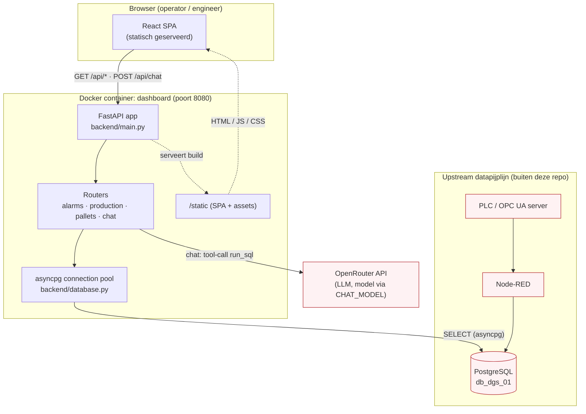
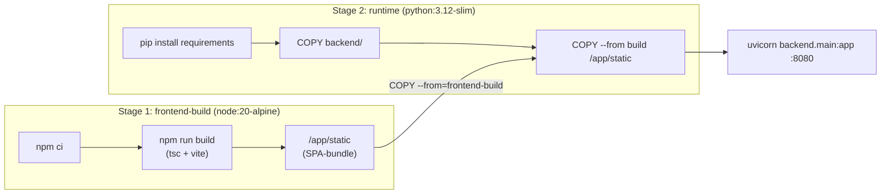
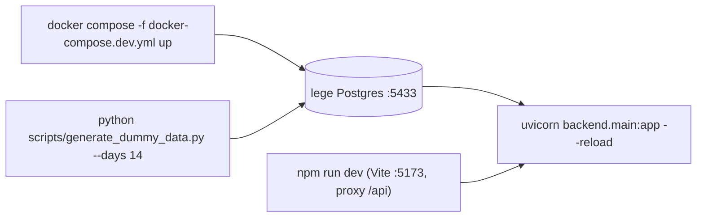
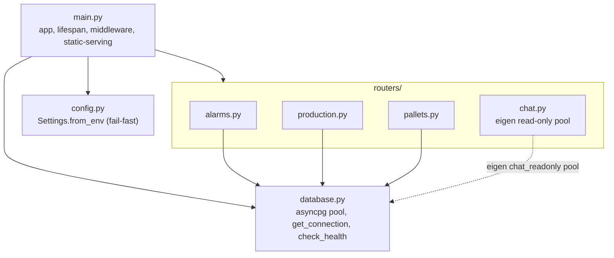
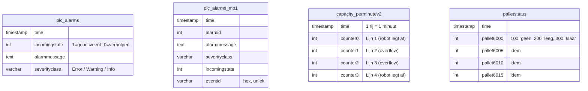
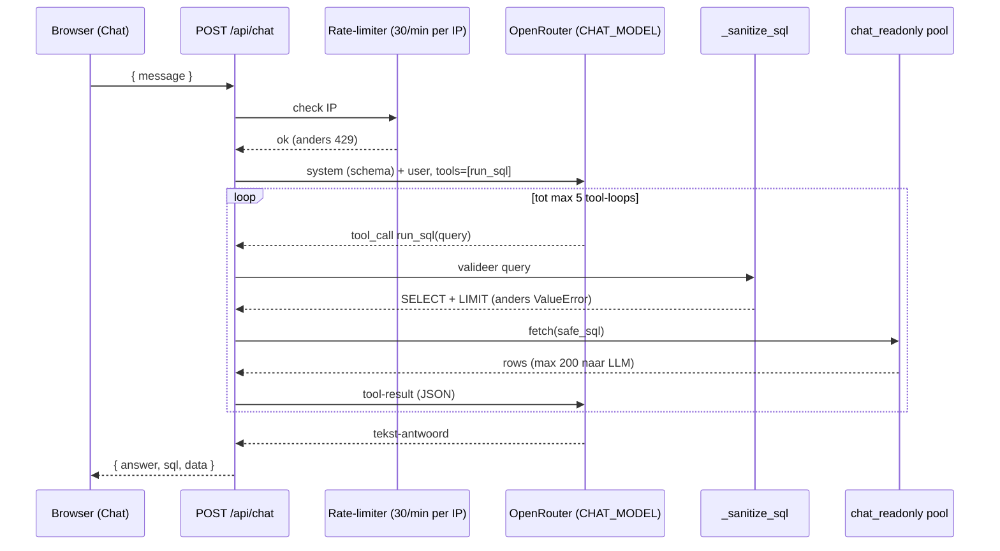
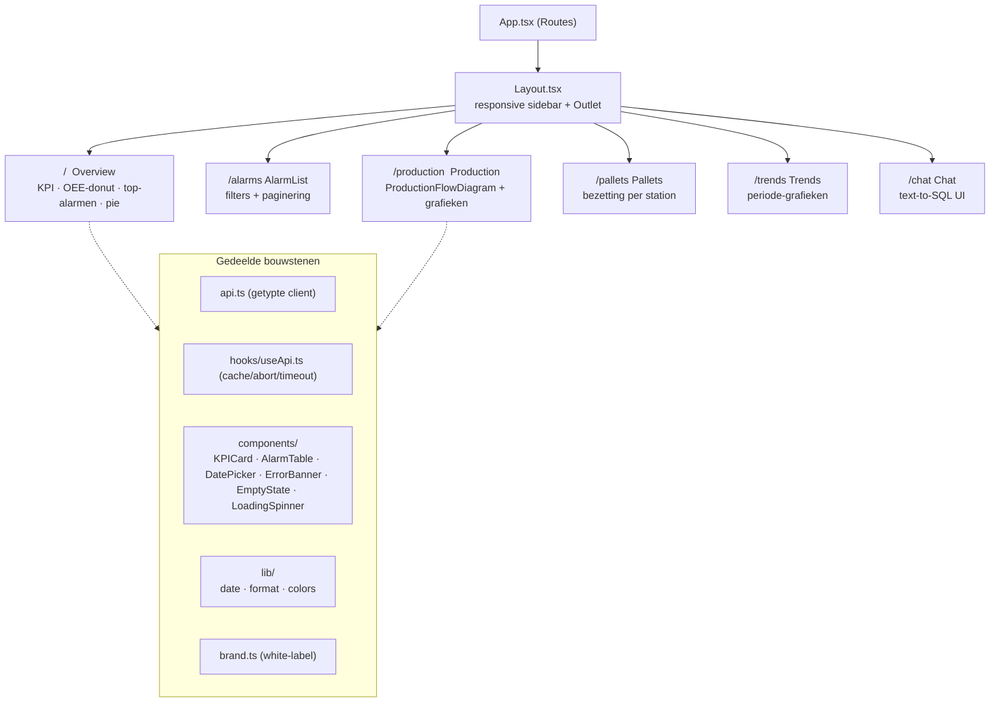

# DGS Optimax, Architectuurdocumentatie

> Interactief productie- en alarmdashboard voor de DGS-fabriek (vleesverwerking, Haaksbergen).
> Dit document beschrijft hoe de applicatie is opgebouwd en waarom de keuzes zo gemaakt zijn.

| | |
|---|---|
| **Component** | DGS Optimax (`projects/dgs/alarm-dashboard`) |
| **Type** | Full-stack web-applicatie (FastAPI + React SPA) |
| **Doelgroep doc** | Intern technisch (Uland AI, onboarding en overdracht) |
| **Status code** | 1 squashed commit (2026-05-28), draait als Docker-stack |
| **Laatst herzien** | 2026-06-03 (na maintainability- en schaalbaarheids-refactor) |

> **Refactor 2026-06-03.** Dit document is bijgewerkt na een onderhoud-ronde: gedeelde
> datum-validatie (`backend/timewindow.py`), één pool-factory, gedeelde frontend-helpers
> (`frontend/src/lib/`), `brand.js` → `brand.ts`, sargable queries + index voor partition
> pruning, en chat-hardening (env-credentials, configureerbare TLS, concurrency-semafoor).
> De meeste punten uit [sectie 12](#12-aandachtspunten) zijn daarmee opgelost.

---

## Inhoud

1. [Inleiding en doel](#1-inleiding-en-doel)
2. [Architectuur in een oogopslag](#2-architectuur-in-een-oogopslag)
3. [Technologie-stack en rationale](#3-technologie-stack-en-rationale)
4. [Deployment en infrastructuur](#4-deployment-en-infrastructuur)
5. [Backend-architectuur](#5-backend-architectuur)
6. [Datalaag en datamodel](#6-datalaag-en-datamodel)
7. [KPI-afleidingen](#7-kpi-afleidingen)
8. [AI-chat module (text-to-SQL)](#8-ai-chat-module-text-to-sql)
9. [Frontend-architectuur](#9-frontend-architectuur)
10. [Cross-cutting concerns](#10-cross-cutting-concerns)
11. [Ontwerpbeslissingen en rationale](#11-ontwerpbeslissingen-en-rationale)
12. [Aandachtspunten](#12-aandachtspunten)
13. [Appendix](#13-appendix)

---

## 1. Inleiding en doel

### Wat is Optimax

DGS Optimax is een webdashboard dat de PLC-data van de DGS-productielijn (alarmen, productietellers, palletposities) ontsluit als interactieve KPI-weergaven. Het leest uit dezelfde PostgreSQL-database (`db_dgs_01`) als het bestaande `alarm-report`, maar vervangt de dagelijkse e-mail door een interactieve UI met datumkeuze, filters, trends, OEE-analyse en een AI-chat die natuurlijke taal naar SQL vertaalt.

### Waarom het bestaat

Het `alarm-report` stuurde één keer per dag een statisch e-mailoverzicht. Dat is goed voor "wat gebeurde er gisteren", maar niet voor onderzoek: je kunt niet inzoomen, niet filteren, geen periode vergelijken en geen ad-hoc-vraag stellen. Optimax adresseert exact dat: dezelfde data, maar doorzoekbaar en visueel.

### Geproductiseerd (white-label)

De naam "Optimax" is bewust generiek. De applicatie is opgezet als herbruikbaar product: via één bestand ([frontend/src/brand.ts](frontend/src/brand.ts)) zijn naam, subtitel, logo, kleuren en lijn-kleuren te wijzigen, waarna het hele dashboard rebrandt. DGS is de eerste invulling (rood `#ED1C24`), maar de architectuur is niet DGS-specifiek behalve in het datamodel en de KPI-formules.

### Scope

| In scope | Buiten scope |
|---|---|
| Alarmen (overzicht, lijst, trends, open alarmen) | Schrijven naar de PLC of database |
| Productie-KPI's (throughput, stilstand, OEE, lijn-balans) | Authenticatie / gebruikersbeheer |
| Pallet-bezetting per station | Real-time push (data is read-on-demand) |
| Cross-table analyse (alarm-impact op productie) | Sensor-data ES-lijn (niet beschikbaar bij klant) |
| AI-chat (text-to-SQL over de 4 tabellen) | Onderhoudslogboek (geen data bij klant) |

---

## 2. Architectuur in een oogopslag

Optimax is een **single-origin** applicatie: één FastAPI-proces serveert zowel de JSON-API (`/api/*`) als de gebouwde React-SPA (statische bestanden). Daardoor is er geen CORS, één poort (8080), één container.



**Deployment-context:** de container draait op een Linux ARM64 edge-device in de fabriek, of lokaal via Docker Compose. De database staat op het DGS-interne netwerk (`192.168.23.254:5432`), bereikbaar via een Ixon VPN-tunnel. De upstream-pijplijn (PLC, OPC UA, Node-RED) valt buiten deze repo: Optimax is een pure read-consument van de database.

---

## 3. Technologie-stack en rationale

| Laag | Keuze | Versie | Waarom |
|---|---|---|---|
| Web-framework | **FastAPI** | 0.115 | Async, type-hints, automatische validatie via query-params, minimale boilerplate |
| ASGI-server | **uvicorn[standard]** | 0.34 | Standaard async-server voor FastAPI |
| DB-driver | **asyncpg** | 0.30 | Snelste async PostgreSQL-driver, native pooling, geen ORM-overhead |
| LLM-client | **openai SDK** | 1.82 | OpenAI-compatibele client, gericht op OpenRouter (model-agnostisch) |
| Config | **python-dotenv** | 1.1 | `.env`-lading, geen secrets in code |
| Frontend-runtime | **React** | 19 | Componentmodel, brede kennis in het team |
| Build-tool | **Vite** | 6 | Snelle dev-server met `/api`-proxy, eenvoudige productie-build |
| Taal frontend | **TypeScript** | 5.8 | Type-veiligheid, API-contract als interfaces in [api.ts](frontend/src/api.ts) |
| Styling | **Tailwind CSS** | 3.4 | Utility-first, white-label kleuren via `brand.ts` |
| Grafieken | **recharts** | 2.15 | Declaratieve React-charts (bar, pie, lijn) |
| Iconen | **lucide-react** | 0.511 | Lichte, consistente SVG-iconset |
| Routing | **react-router-dom** | 7.6 | Client-side routing voor de 6 pagina's |
| Packaging | **Docker** (multi-stage) | - | Node-build + Python-runtime in één image, reproduceerbaar |

De stack is bewust klein en mainstream: geen ORM, geen state-management-library, geen API-gateway. Voor een read-heavy dashboard met een handvol pagina's is dat een passende keuze (zie [sectie 11](#11-ontwerpbeslissingen-en-rationale)).

---

## 4. Deployment en infrastructuur

> De afweging cloud versus edge (waarom Optimax lokaal op een edge-device draait en niet volledig in de cloud) is vastgelegd in [ADR-001](ADR-001-deployment-edge-vs-cloud.md).

### Multi-stage Docker-build

De [Dockerfile](Dockerfile) bouwt in twee stages, zodat de Node-toolchain niet in het runtime-image belandt:



De frontend-build schrijft naar `../static` (zie [vite.config.ts](frontend/vite.config.ts), `outDir: "../static"`), en stage 2 kopieert die map in het Python-image. FastAPI serveert die map direct (zie [sectie 5](#5-backend-architectuur)).

### Compose-stacks

| Stack | Bestand | Inhoud |
|---|---|---|
| Productie | [docker-compose.yml](docker-compose.yml) | `db` (postgres:16-alpine, healthcheck, volume) + `dashboard` (build, depends_on healthy db, log-rotatie, restart unless-stopped) |
| Lokaal dev | [docker-compose.dev.yml](docker-compose.dev.yml) | Alleen een lege `db` op poort 5433 (`dgs_dev`/`dgs_dev_local`), te vullen met dummy data |

In productie zet de compose `DB_HOST: db` (de servicenaam) en forceert `LOG_FORMAT: json`. Beide services hebben `json-file`-logging met grootte- en bestandslimieten.

### Lokaal ontwikkelen zonder VPN

Omdat de echte database achter een VPN zit, kan niet iedereen er altijd bij. Het script [scripts/generate_dummy_data.py](scripts/generate_dummy_data.py) vult een lokale Postgres met realistische dummy-data (alarmen met trigger/resolve-paren, productietellers per minuut binnen shift, palletstatussen). Daarmee is de hele app lokaal te draaien zonder fabrieksverbinding.



### Environment-variabelen

Configuratie komt volledig uit `.env` (template: [.env.example](.env.example)). Verplicht zijn `DB_HOST`, `DB_NAME`, `DB_USER`, `DB_PASSWORD`; bij ontbreken stopt de app met een duidelijke melding (fail-fast, zie [config.py](backend/config.py)). Zie de [env-tabel in de appendix](#env-variabelen).

### Claude Code koppeling

[.mcp.json](.mcp.json) definieert een read-only `dgs-postgres` MCP-server (`@modelcontextprotocol/server-postgres`) zodat Claude Code rechtstreeks SQL-verkenning op de database kan doen tijdens ontwikkeling. Write-operaties zijn workspace-breed geblokkeerd via een PreToolUse-hook.

---

## 5. Backend-architectuur

De backend is een compacte FastAPI-app met een duidelijke laagscheiding: `main` (lifecycle + cross-cutting), `config` (settings), `database` (pool), en vier routers (business-logica per domein).



### App-lifecycle (lifespan)

[main.py](backend/main.py) gebruikt een `lifespan`-context-manager. Bij opstart: laad settings, open de asyncpg-pool, initialiseer de chat-client en chat-pool. Bij afsluiten: sluit beide pools netjes. Logging wordt al vóór de app-constructie opgezet (`_setup_logging()`), zodat ook opstartfouten gelogd worden.

### Gedeelde validatie-patronen

Drie routers (alarms, production, pallets) delen dezelfde datum-validatie uit
[backend/timewindow.py](backend/timewindow.py) (sinds de refactor één bron i.p.v. drie kopieën):

- `validate_date(...)`: default = **gisteren** (`date.today() - 1`), weiger toekomstige datums.
- `validate_range(...)`: default-periode = laatste 30 dagen, weiger einddatum in de toekomst, weiger `from > to`, cap op `MAX_TREND_DAYS = 365`.

Het defaulten naar gisteren sluit aan op de werkwijze van het alarm-report en op het feit dat "vandaag" nog niet compleet is.

### Request-logging en globale error-afhandeling

Een HTTP-middleware in [main.py](backend/main.py) meet de duur van elk request. Responses met status >= 400 worden als warning gelogd; een onverwachte exception wordt volledig gelogd (met traceback) en als een nette `500 {"detail": "Internal server error"}` teruggegeven. Zo lekt er nooit een stacktrace naar de client, maar staat hij wel in de logs.

### Static-serving en SPA-fallback

Als de `static`-map bestaat (na build), mount FastAPI `/assets` als statische map en registreert twee routes: `/` levert `index.html`, en een catch-all `/{path:path}` levert het gevraagde bestand als het bestaat, anders `index.html`. Die fallback laat client-side routing (react-router) werken bij een harde refresh op bijvoorbeeld `/production`.

### Health-endpoint

`GET /api/health` voert `SELECT 1` uit via de pool en geeft `200 {"status":"healthy"}` of `503 {"status":"unhealthy"}`. Dit is de basis voor de Docker-healthcheck en monitoring.

---

## 6. Datalaag en datamodel

### Connection pool met graceful degradation

[database.py](backend/database.py) houdt één module-globale `asyncpg.Pool` (min 5, max 20 connecties, `command_timeout=25s`, connect-`timeout=5s`). Cruciaal detail: als de pool bij opstart niet gemaakt kan worden (DB onbereikbaar, bijvoorbeeld VPN omlaag), logt de app een warning en start **zonder** database in plaats van te crashen. Endpoints falen dan netjes en `/api/health` rapporteert `unhealthy`. De `get_connection()`-context-manager levert per request een connectie uit de pool.

Sinds de refactor worden beide pools (hoofd + chat) gemaakt via één factory `create_db_pool(settings, *, user, password, min_size, max_size)`, zodat host/poort/timeouts niet op twee plekken uit elkaar lopen.

### Datamodel

De backend leest vier PLC-tabellen. De data wordt elders aangeleverd (PLC → OPC UA → Node-RED → Postgres), Optimax definieert het schema niet.



**Belangrijke domein-semantiek:**

- **Alarm-state:** `incomingstate = 1` is een trigger (alarm geactiveerd), `0` is een resolve (verholpen). Een "open alarm" is een alarmmessage waarvan het laatste event op een dag een `1` is.
- **Counters:** elke rij in `capacity_perminutev2` is één minuut. `counterX` is het aantal getelde producten op die lijn in die minuut. Lijn 1 en 4 tellen wat de **robot aflegt** (robot-output); lijn 2 en 3 zijn de **overflow** die daarna overblijft. Een hoog overflow-aandeel betekent dat de robot het aanbod niet bijhoudt. Deze indeling wordt gevisualiseerd in de [ProductionFlowDiagram](#9-frontend-architectuur).
- **Palletstations:** vernoemd naar de IX6000 edge-device-poorten (6000/6005/6010/6015). Statuscodes 100/200/300 = geen pallet / leeg-wachtend / klaar.

**Beschikbaarheid van tabellen** (zie [CLAUDE.md](CLAUDE.md)): `plc_alarms`, `plc_alarms_mp1`, `capacity_perminutev2` en `palletstatus` zijn bevestigd. `machines` en `production_lines` zijn verwacht maar nog niet gebruikt. `sensor_data` (ES-lijn) en `maintenance_log` zijn niet beschikbaar bij de klant en daarom buiten scope.

### Data-kenmerken

| Kenmerk | Waarde |
|---|---|
| Sample rate (PLC) | ~250 ms |
| Productietellers | 1 rij per minuut |
| Shift | 05:00 tot 23:00 (1080 min, 18 uur) |
| Retentie | 90 dagen |

### Partitionering en sargable filters

De productie-database (en de lokale prod-spiegel) **partitioneert per dag** op `time`
(RANGE-partities `plc_alarms_YYYYMMDD`, `capacity_perminutev2_YYYYMMDD`, etc.). Twee regels
houden dat snel, en zijn sinds de refactor doorgevoerd:

- **Sargable datum-filters.** Filter op een bereik, niet op een cast:
  `WHERE time >= $1::date AND time < $1::date + 1` (NIET `WHERE time::date = $1`).
  De cast-vorm verhindert **partition pruning** én index-gebruik, waardoor elke dag-query
  álle dagpartities scant. Gemeten op de prod-spiegel (10 partities): cast-vorm scant alle 10,
  sargable vorm prunet naar 1 (in productie met ~90 dagen retentie scheelt dat ~90×).
- **Index op `time`** per partitioned parent (propageert naar alle partities).

### SQL-patronen

Alle queries zijn **parameterized** (`$1`, `$2`, ...), ook waar dynamische filters worden opgebouwd (zie de alarmenlijst). Kenmerkende technieken:

- **Sargable bereik-filter op `time`** (zie hierboven) i.p.v. `time::date = $1`.
- **Conditionele aggregatie:** `COUNT(*) FILTER (WHERE incomingstate = 1)` voor trigger/resolve-tellingen.
- **Window-functies:** `LEAD(...) OVER (PARTITION BY alarmmessage ORDER BY time)` voor MTTR-paring (trigger gevolgd door resolve).
- **Timezone-correctie:** uur- en minuut-groeperingen gebruiken `AT TIME ZONE 'Europe/Amsterdam'` zodat de uren in Nederlandse tijd kloppen.
- **Veilige delingen:** `NULLIF(COUNT(*), 0)` voorkomt deling door nul in percentage-berekeningen.
- **Deterministische sortering:** top-alarmen sorteren op `trigger_count DESC, alarmmessage` (tiebreaker) zodat de volgorde stabiel is.
- **`DISTINCT ON`:** voor het laatste event per alarmmessage (open alarmen).

---

## 7. KPI-afleidingen

De kern van de waarde van Optimax zit in de afleidingen: van ruwe PLC-tellers naar betekenisvolle KPI's. Onderstaande tabel koppelt elke KPI aan zijn bron, formule, endpoint en UI-plek. De formules staan uitgebreid gedocumenteerd in de docstrings van [production.py](backend/routers/production.py) en [pallets.py](backend/routers/pallets.py).

| KPI | Bron | Formule (kern) | Endpoint | UI |
|---|---|---|---|---|
| Alarmen geactiveerd/verholpen | `plc_alarms` | `COUNT FILTER incomingstate=1/0` | `/api/alarms/stats` | Overzicht KPI-kaarten |
| Top-alarmen | `plc_alarms` | `COUNT FILTER ... GROUP BY message` | `/api/alarms/top` | Bar chart |
| Open alarmen | `plc_alarms` | laatste event per message met state=1 | `/api/alarms/open` | Overzicht |
| Alarmenlijst | `plc_alarms` | gefilterd + gepagineerd | `/api/alarms/list` | Alarmen-pagina |
| Alarm-trend | `plc_alarms` | per dag trigger vs resolve | `/api/alarms/trends` | Trends |
| Productie per lijn | `capacity_perminutev2` | `SUM(counterX)` per dag | `/api/production/summary` | Productie |
| Stilstand-minuten | `capacity_perminutev2` | `COUNT(counterX=0)` binnen shift | `/api/production/summary` | Productie |
| Piekuur | `capacity_perminutev2` | uur met max `SUM(alle counters)` | `/api/production/summary` | Productie |
| Lijn-balans | `capacity_perminutev2` | `MIN(lijn)/MAX(lijn)`, ideaal 1.0 | `/api/production/summary` | Productie |
| **MTTR** | `plc_alarms` | gem. tijd trigger→resolve via `LEAD()` | `/api/production/summary` | Productie |
| Productie per uur/minuut | `capacity_perminutev2` | `SUM(counterX)` per uur/minuut | `/api/production/hourly`, `/minutely` | Flow-diagram |
| **Alarm-impact** | beide tabellen | gem. productie tijdens vs zonder alarm-minuut | `/api/production/alarm-impact` | Productie |
| **OEE** | beide tabellen | `Availability × Performance × Quality` | `/api/production/oee` | Overzicht (donut) |
| Pallet-bezetting | `palletstatus` | `% tijd status=300/200/100` per station | `/api/pallets/summary`, `/hourly` | Pallets |

### Twee afleidingen uitgelicht

**MTTR (Mean Time To Resolve).** Per alarmmessage kijkt `LEAD()` naar het eerstvolgende event. Alleen paren `state=1 → state=0` tellen als opgelost; het tijdsverschil is de resolve-tijd. "Orphaned" resolves (een `0` zonder voorafgaande `1`) vallen automatisch af door `WHERE incomingstate = 1`. Niet-afgesloten triggers worden apart geteld als `unresolved`.

**OEE (Overall Equipment Effectiveness).** Per lijn:
- *Availability* = (shift-minuten − stilstand) / shift-minuten.
- *Performance* = werkelijke output / (uptime-minuten × ideal-rate), waarbij de ideal-rate het **95e percentiel** van de per-minuut-output tijdens uptime is (`PERCENTILE_CONT(0.95)`), geclamped op 1.0.
- *Quality* = 100% (placeholder: er is geen uitvaldata uit de PLC).

De vier "Six Big Losses" worden afgeleid: Storingen (Error-alarmen), Kleine stops (Warning), Snelheidsverlies (onderprestatie t.o.v. ideal-rate), Kwaliteitsverlies (placeholder 0). Dat de Quality-component een placeholder is, is een bewuste, gedocumenteerde keuze, geen bug.

---

## 8. AI-chat module (text-to-SQL)

De chat-pagina laat gebruikers in gewoon Nederlands vragen stellen over de data. De backend ([chat.py](backend/routers/chat.py)) vertaalt dat via een LLM naar SQL, voert het read-only uit en formuleert een antwoord.



### Veiligheidslagen (defense-in-depth)

Een LLM die SQL genereert is risicovol. De module stapelt daarom meerdere onafhankelijke barrières:

1. **Aparte read-only DB-user.** De chat gebruikt een eigen pool met een read-only rol (min 2, max 5 connecties), los van de hoofdpool. Credentials komen uit `CHAT_DB_USER`/`CHAT_DB_PASSWORD` (sinds de refactor; eerder hardcoded). Zonder die env-vars valt de chat terug op de hoofdpool.
2. **SELECT-only sanitizer.** `_sanitize_sql()` strip commentaar, eist dat de query met `SELECT` begint, en blokkeert `INSERT/UPDATE/DELETE/DROP/ALTER/TRUNCATE/CREATE/GRANT/REVOKE/EXEC/EXECUTE` met een regex.
3. **Geforceerde LIMIT.** Ontbreekt een `LIMIT`, dan wordt automatisch `LIMIT 1000` toegevoegd.
4. **Per-IP rate-limit.** Maximaal 30 verzoeken per 60 seconden (in-memory sliding window), anders `429`. Let op: gebruikers achter hetzelfde kantoor-NAT delen dit budget. Verlopen IP-entries worden opgeruimd (geen geheugenlek).
5. **Tool-loop-cap.** Maximaal 5 tool-call-rondes per vraag, voorkomt oneindige LLM-lussen.
6. **Resultaat-cap.** Maximaal 200 rijen gaan terug naar het model (token-/kostenbeheersing).
7. **Concurrency-semafoor.** `LLM_CONCURRENCY = 4` begrenst gelijktijdige LLM-conversaties; extra verzoeken wachten kort i.p.v. de chat-pool en de OpenRouter-quota te overspoelen.

**TLS naar OpenRouter** is sinds de refactor veilig by default (`verify=True`). Achter SSL-inspectie kan een CA-bundle worden gezet (`CHAT_CA_BUNDLE`, aanbevolen) of, als laatste redmiddel, verificatie uit via `CHAT_TLS_VERIFY=false` (logt dan een waarschuwing). Eerder stond `verify=False` hardcoded.

### Model-agnostisch

De client praat via de OpenAI-compatibele SDK met OpenRouter (`base_url=https://openrouter.ai/api/v1`). Het model is configureerbaar via `CHAT_MODEL` (default `anthropic/claude-sonnet-4`, maar Gemini, GPT enzovoort kan ook). De chat is optioneel: zonder `OPENROUTER_API_KEY` geeft het endpoint netjes `503`, de rest van het dashboard blijft werken.

Het systeem-prompt (`SCHEMA_CONTEXT`) beschrijft de vier tabellen, dwingt Nederlandse antwoorden af, en geeft regels mee (alleen SELECT, default gisteren, altijd LIMIT). De frontend toont per antwoord de gegenereerde SQL (inklapbaar) en de ruwe data-tabel, zodat een gebruiker kan controleren wat er gebeurde.

---

## 9. Frontend-architectuur

De frontend is een single-page applicatie (React 19 + TypeScript), gebouwd met Vite en gestyled met Tailwind. In productie is het een statische bundle die door FastAPI wordt geserveerd; in dev draait Vite op poort 5173 met een proxy van `/api` naar 8080.

### Routes en compositie



### Data-fetching: de `useApi`-hook

Alle pagina's halen data op via de eigen hook [useApi.ts](frontend/src/hooks/useApi.ts), die drie problemen tegelijk oplost:

- **Caching:** resultaten worden per `cacheKey` (bijv. `stats-2026-06-02`) 60 seconden gecached. Heen-en-weer-navigeren tussen datums is daardoor direct.
- **Cancellation:** elke fetch krijgt een `AbortController`; een nieuwe fetch of unmount aborteert de vorige (geen race-conditions, geen state-updates na unmount).
- **Timeout:** na 15 seconden wordt afgebroken met een begrijpelijke melding ("Controleer of de backend draait"), relevant bij een trage VPN.

De hook levert `{ data, loading, error, retry }`, wat pagina's gebruiken voor loading-spinners, error-banners (met retry-knop) en empty-states.

### API-contract als types

[api.ts](frontend/src/api.ts) is de enige plek waar `fetch` gebeurt. Elke endpoint heeft een getypte functie en bijbehorende `interface` (bijv. `AlarmStats`, `OeeData`, `PalletSummary`). Het API-contract is daarmee expliciet en wijzigingen in de backend-respons worden in de TypeScript-compile zichtbaar.

### Visualisaties

Standaard-grafieken (bar, pie, lijn) komen van **recharts**. De productie-pagina heeft daarnaast een maatwerk-component, [ProductionFlowDiagram.tsx](frontend/src/components/ProductionFlowDiagram.tsx): een geanimeerd SVG-fabrieksschema dat de centrale robotarmen toont die afleggen op lijn 1 en 4, met de overflow (lijn 2 en 3) als rest, kleurgecodeerd naar overflow-druk. Klikken op een uur in de tijdlijn laadt via `/api/production/minutely` de per-minuut-detail (sparkline per lijn met hover). Dit is de meest domein-specifieke en visueel rijkste UI-component.

### Gedeelde helpers (`lib/`)

Sinds de refactor staan herhaalde helpers op één plek in [frontend/src/lib/](frontend/src/lib/):
- `date.ts`: `yesterday()`, `today()`, `isoDate()`, `rangeEndingYesterday()` (eerder 4× gekopieerd).
- `format.ts`: `formatTime()`, `formatDate()` (Nederlandse locale).
- `colors.ts`: `SEVERITY_BADGE` (Tailwind) en `SEVERITY_CHART` (hex), eerder per pagina herhaald.

### White-label via `brand.ts`

[brand.ts](frontend/src/brand.ts) is de enige bron van merk-instellingen en wordt op twee plekken geïmporteerd:
- **Build-time** in [tailwind.config.js](frontend/tailwind.config.js): de kleuren worden de `dgs-*` Tailwind-palette.
- **Runtime** in React-componenten: app-naam, subtitel, logo, footer, lijn-kleuren, chart-accent.

Het bestand bevat een uitgecommentarieerd "demo-profiel" (generiek blauw), zodat rebranden neerkomt op één bestand aanpassen. Dit is de technische kern van het "Optimax als product"-idee. (Voorheen `brand.js` + `brand.d.ts`; samengevoegd tot één getypeerd `brand.ts`.)

---

## 10. Cross-cutting concerns

### Security

- **Read-only by design:** de app doet uitsluitend SELECT. De chat draait bovendien onder een aparte read-only DB-user met een gestapelde SQL-sanitizer (zie [sectie 8](#8-ai-chat-module-text-to-sql)).
- **Optionele HTTP Basic Auth:** env-gated (`DASHBOARD_AUTH_USER`/`PASSWORD`), default uit. Aan = alle routes achter login behalve `/api/health`. Minimaal; voor productie SSO/proxy-auth.
- **Geen secrets in de repo:** alle credentials komen uit `.env` (in `.gitignore`). De template [.env.example](.env.example) staat wel in de repo.
- **Single-origin:** API en SPA op dezelfde origin betekent geen CORS-configuratie en geen cross-site-vraagstukken.
- **Foutafhandeling lekt niets:** de globale middleware geeft een generieke 500 naar de client en houdt de traceback in de logs.

### Observability

- **Logging:** JSON met een `request_id` per verzoek (zie `backend/observability.py`),
  configureerbaar via `LOG_FORMAT` (text/json) en `LOG_LEVEL`. Console + `RotatingFileHandler`
  (`logs/dashboard.log`, 5 MB × 5).
- **Request-correlatie:** elk verzoek krijgt een `request_id` in de logs, in de `X-Request-ID`
  response-header en in de body van een 500. Support traceert daarmee een melding terug.
- **Health/versie:** `/api/health` (DB, versie, uptime, pool-stats) voedt de Docker-healthcheck;
  `/api/version` toont de draaiende build (commit via `APP_COMMIT`).
- **Metrics:** `/api/metrics` (JSON) en `/api/metrics/prometheus` (scrape-baar) uit een lichte
  in-process teller; chat-conversaties loggen tokenverbruik.
- **Frontend:** een ErrorBoundary voorkomt witte schermen en rapporteert render-fouten naar
  `/api/client-log` (verschijnen in de server-logs).
- **Optioneel:** `docker-compose.observability.yml` (Prometheus + Loki + Promtail + Grafana).

### Performance

- **Connection pooling:** asyncpg-pool (5-20) hergebruikt connecties; `command_timeout=25s` voorkomt hangende queries.
- **Partition pruning + index:** sargable `time`-filters laten Postgres één dagpartitie kiezen i.p.v. alle (zie [sectie 6](#6-datalaag-en-datamodel)).
- **Client-side cache:** 60s TTL in `useApi` beperkt herhaalde calls.
- **Aggregatie in de database:** zware berekeningen (window-functies, percentielen) gebeuren in PostgreSQL, niet in Python; de backend doet alleen lichte transformatie naar JSON.

### Schaalbaarheid (gemeten)

Load-test ([scripts/load_test.py](scripts/load_test.py)) tegen de nep-DB, één async uvicorn-worker,
elke gebruiker doorloopt alle vijf pagina's per ronde (12 calls), zonder browser-cache (worst-case):

| Gelijktijdige gebruikers | p50 | p95 | p99 | Fouten | Throughput |
|---|---|---|---|---|---|
| 5  | 10 ms | 13 ms | 26 ms | 0% | ~264 req/s |
| 10 | 18 ms | 34 ms | 57 ms | 0% | ~265 req/s |
| 20 | ~45 ms | ~100 ms | — | 0% | ~265 req/s |

**Conclusie: 5 gelijktijdige gebruikers is triviaal** (p95 13 ms), met ruime marge tot ~20.
Throughput plateaut rond ~265 req/s: de grens van één async worker. Voor 50+ gelijktijdig:
draai uvicorn met `--workers N` (let op: de 60s-cache en chat-rate-limit worden dan per-worker;
voor echt grote schaal hoort dat naar een gedeelde store zoals Redis). De chat schaalt apart
(LLM-latency in seconden, begrensd door de concurrency-semafoor).

### Configuratie

Volledig environment-driven met fail-fast validatie ([config.py](backend/config.py)): ontbrekende verplichte variabelen stoppen de app vóór hij draait, met een instructie om `.env.example` te kopiëren. De `Settings`-dataclass is `frozen` (immutable na laden).

---

## 11. Ontwerpbeslissingen en rationale

Beknopte ADR-stijl: de beslissing, en waarom.

| # | Beslissing | Waarom |
|---|---|---|
| 1 | **Single-origin** (FastAPI serveert API + SPA) | Eén container, één poort, geen CORS, simpele ops op een edge-device |
| 2 | **asyncpg + raw parameterized SQL, geen ORM** | KPI's zijn complexe aggregaties/window-functies die in SQL helderder en sneller zijn; read-only werk heeft geen ORM-mapping nodig |
| 3 | **Graceful DB-degradation** | De DB zit achter een VPN die kan wegvallen; de app moet starten en netjes `unhealthy` rapporteren i.p.v. crashen |
| 4 | **KPI-logica dicht bij de data** | Window-functies en percentielen horen in de database; Python doet alleen presentatie-transformatie |
| 5 | **Client-side caching (60s) + abort + timeout** | Snelle UX bij datum-navigatie en robuustheid bij een trage verbinding |
| 6 | **Text-to-SQL met defense-in-depth** | Natuurlijke-taal-analyse is waardevol, maar LLM-SQL vereist gestapelde barrières (read-only user, sanitizer, LIMIT, rate-limit) |
| 7 | **OpenRouter via OpenAI-SDK** | Model-agnostisch: wissel het LLM via één env-var zonder codewijziging |
| 8 | **White-label via `brand.ts`** | Optimax als herbruikbaar product; rebranden = één bestand |
| 9 | **Dummy-data-generator + dev-compose** | Ontwikkelen en demonstreren zonder VPN/echte fabrieksdata |
| 10 | **Default-datum = gisteren** | Sluit aan op alarm-report-erfenis; "vandaag" is nog niet compleet |
| 11 | **Multi-stage Docker-build** | Node-toolchain blijft buiten het runtime-image: kleiner, schoner |

---

## 12. Aandachtspunten

**Opgelost in de refactor 2026-06-03:**

- ~~**Hardcoded chat-credentials.**~~ Verplaatst naar `CHAT_DB_USER`/`CHAT_DB_PASSWORD`.
- ~~**TLS-verificatie uit (hardcoded `verify=False`).**~~ Nu veilig by default; escape-hatch via `CHAT_CA_BUNDLE` of `CHAT_TLS_VERIFY=false` (met waarschuwing).
- ~~**Lokale ongetrackte `.js` naast `.tsx` + ontbrekende `noEmit`.**~~ `tsconfig.json` heeft nu `noEmit`, build-script `tsc --noEmit && vite build`, stray `.js` opgeruimd en in `.gitignore`; `brand.js`+`brand.d.ts` samengevoegd tot `brand.ts`.
- ~~**SPA catch-all zonder pad-controle.**~~ De catch-all controleert nu dat het pad binnen `static` blijft (geen pad-traversal).
- ~~**Niet-deterministische top-alarmen.**~~ Tiebreaker `ORDER BY trigger_count DESC, alarmmessage` toegevoegd.
- ~~**Dummy-data palletstatus.**~~ Schreef `0/1/2`, queries verwachten `100/200/300`; gecorrigeerd in de generator.

**Opgelost in de observability/supportability-ronde:**

- ~~**Geen authenticatie.**~~ Optionele HTTP Basic Auth toegevoegd (env-gated, default uit). Voor productie nog naar SSO/proxy-auth.
- ~~**Geen geautomatiseerde tests.**~~ pytest-suite toegevoegd (`backend/tests/`): units + API + observability + auth. Frontend-tests (vitest) nog te doen.
- ~~**Geen observability/runbook.**~~ Request-id-correlatie, metrics, version, alerting-script, observability-stack en [RUNBOOK.md](RUNBOOK.md) toegevoegd.

**Nog open (bewust benoemd):**

- **Auth productie-waardig maken:** Basic Auth is een minimale gate; SSO of reverse-proxy-auth is de echte oplossing.
- **Frontend-tests:** backend heeft pytest; frontend nog geen vitest/component-tests.
- **Tracing (OpenTelemetry):** bewust uitgesteld; het `request_id` dekt correlatie voor één service, full tracing is voor een multi-service-landschap.
- **Redis voor cache/rate-limit:** alleen nodig bij multi-worker/multi-instance schaal; in-process is prima voor de huidige load.
- **Gesquashte git-historie:** alles begon in één commit (2026-05-28).

### Onafhankelijke architectuur-review (2026-06-10)

Verse review van de volledige codebase, los van de security-review van 2026-06-09. Focus: betrouwbaarheid, KPI-correctheid en operationele gedragingen die het draaien bij een klant raken. Severity: (H)oog, (M)iddel, (L)aag.

**Betrouwbaarheid en frontend (nieuw gevonden):**

- **(H) Geen DB-reconnect na mislukte start.** [database.py](backend/database.py) `init_pool()` zet `_pool = None` bij een onbereikbare database en er is geen re-init-pad: de app blijft permanent zonder DB tot een handmatige container-herstart. Op het edge-device is dit reëel: na een stroomuitval starten de containers los van elkaar (geen compose-`depends_on` op de IXrouter), dus als het dashboard eerder op is dan Postgres blijft het voor altijd `unhealthy`. De graceful degradation degradeert wel, maar herstelt nooit. Fix: lazy re-init in `get_connection()`/`check_health()` (retry met backoff bij `_pool is None`).
- **(H) Frontend-timeout en cancellation werken niet zoals gedocumenteerd.** Sectie 9 van dit document claimt "elke fetch krijgt een AbortController" en "na 15 seconden wordt afgebroken met een begrijpelijke melding". In de code is de `AbortController` in [useApi.ts](frontend/src/hooks/useApi.ts) echter **niet gekoppeld** aan de fetch: [api.ts](frontend/src/api.ts) `get()` geeft geen `signal` mee. Gevolg 1: een abort annuleert het netwerk-request niet. Gevolg 2: na de 15s-timeout staat `signal.aborted` op true, waardoor de guards in `.catch`/`.finally` juist de foutmelding én `setLoading(false)` overslaan: de pagina blijft eeuwig op "loading" staan en de time-out-melding is onbereikbare code. Dit raakt precies het doelscenario (trage VPN). Fix: `signal` doorgeven aan `fetch`, en onderscheid maken tussen abort-door-vervanging (negeren) en abort-door-timeout (fout tonen).
- **(M) Chat-resultaat-cap beschermt tokens, niet geheugen.** [chat.py](backend/routers/chat.py) `_execute_query()` doet `conn.fetch(safe_sql)` en sliced daarna pas naar 200 rijen: de volledige resultset komt eerst in RAM. Gecombineerd met de naïeve LIMIT-detectie (`\bLIMIT\b` ergens in de query, dus een LIMIT in een subquery voorkomt de outer-LIMIT) kan één LLM-query op de 250ms-tabellen miljoenen rijen ophalen en de container tegen de `mem_limit` van 512 MB aan OOM-killen. Fix: forceer een outer-LIMIT door te wrappen (`SELECT * FROM (...) sub LIMIT 1000`) of begrens de fetch zelf (cursor/`fetch` met max rows).
- **(M) De sanitizer weigert CTE's, ook legitieme.** `_sanitize_sql()` eist `startswith("SELECT")`, dus elke `WITH ... SELECT`-query van het LLM faalt. Dat is geen lek maar een functionele beperking die antwoordkwaliteit kost (het model krijgt een foutmelding op correcte SQL). Fix: accepteer `^\s*(SELECT|WITH)\b` en houd de forbidden-keyword-check als gate (die dekt DML binnen CTE's al af).

**KPI-correctheid (nieuw gevonden, raakt de cijfers die de klant ziet):**

- **(H) Inconsistente timezone-behandeling binnen de KPI-laag.** Het shift-venster in [production.py](backend/routers/production.py) filtert `time::time BETWEEN 05:00 AND 23:00` zonder TZ-conversie, terwijl piekuur/hourly/minutely `AT TIME ZONE 'Europe/Amsterdam'` gebruiken en alarm-impact weer naive `date_trunc` doet. Die drie kunnen niet alle drie kloppen: het hangt ervan af of Node-RED naive lokale tijd of UTC schrijft. Let op: `timestamp AT TIME ZONE 'Europe/Amsterdam'` op een naive kolom **interpreteert** de waarde als Amsterdam-tijd (het converteert niet vanuit UTC); voor UTC-data is het resultaat 1-2 uur fout. Daarnaast draait `date.today()` in [timewindow.py](backend/timewindow.py) op container-tijd (vermoedelijk UTC): tussen 00:00 en 02:00 NL-tijd verschuift de "gisteren"-default een dag. Actie: stel eenmalig vast in welke tijdzone de PLC-data wordt geschreven, kies één conversiestrategie voor alle queries, en zet `TZ=Europe/Amsterdam` in de container.
- **(M) Ontbrekende minuten tellen als uptime in plaats van stilstand.** Stilstand en OEE-availability tellen `COUNT(*) FILTER (WHERE counterX = 0)` over de **aanwezige** rijen, en de noemer is `COUNT(*)`. Als de pijplijn bij een echte storing geen rijen schrijft (lijn plat, logger uit), telt die periode niet als downtime en wordt availability geflatteerd, precies wanneer het ertoe doet. Fix: genereer het shift-raster met `generate_series` en behandel ontbrekende minuten als downtime, of rapporteer datagaten expliciet.
- **(M) "Productie tijdens alarm" meet alleen de trigger-minuut.** De alarm-impact-KPI joint op `DISTINCT date_trunc('minute', time)` van trigger-events: een alarm dat 30 minuten open staat telt 1 minuut als "tijdens alarm" en 29 als "zonder alarm". De KPI-naam belooft alarmduur-impact, de implementatie meet trigger-moment-dip. Fix: bouw alarm-intervallen (trigger tot resolve, zoals de MTTR-pairing al doet) en classificeer minuten binnen die intervallen.
- **(L) DST-dagen:** `SHIFT_MINUTES` is hardcoded 1080; op de twee klok-verzetdagen per jaar klopt de noemer niet.
- **(L) MTTR over middernacht:** een trigger om 23:50 met resolve na middernacht telt als unresolved vandaag en orphan morgen. Zeldzaam (shift eindigt 23:00), maar bekend gedrag.

**Product en operatie (nieuw gevonden):**

- **(M) De chat heeft geen conversatie-geheugen.** [Chat.tsx](frontend/src/pages/Chat.tsx) bewaart de historie alleen client-side (localStorage); `sendChatMessage()` stuurt uitsluitend het laatste bericht en de backend bouwt per request een verse conversatie. Vervolgvragen ("en de week ervoor?") missen daardoor alle context. Voor een chat-interface is dit een wezenlijke beperking; meesturen van de laatste N berichten is een kleine wijziging (let op token-budget).
- **(M) Paginering-randgeval in de alarmenlijst.** [alarms.py](backend/routers/alarms.py) `/list` clamp't het paginanummer pas ná de query: bij `page` voorbij de laatste pagina komt een lege items-lijst terug met een geclampt paginanummer dat suggereert dat je op een geldige pagina staat. Clamp vóór de OFFSET-berekening. Daarnaast worden `%` en `_` in de zoekterm niet ge-escaped voor ILIKE (zoeken op "100%" matcht te veel).
- **(L) SPA-caching ontbreekt.** `index.html` wordt zonder `Cache-Control: no-cache` geserveerd en de gehashte assets zonder `immutable`: na een deploy kan een browser een oude `index.html` vasthouden die naar verdwenen asset-hashes wijst (witte pagina tot harde refresh), en op de trage VPN worden assets onnodig her-gevalideerd.
- **(L) `load_dotenv(override=True)`** in [main.py](backend/main.py) laat een `.env`-bestand winnen van door de orchestrator gezette env-vars, het omgekeerde van de gangbare precedence (en van wat het Dockerfile-commentaar belooft). `.dockerignore` sluit `.env` uit dus de container-impact is beperkt, maar het blijft een verrassing bij lokaal draaien en bij elke toekomstige mount. Overweeg `override=False`.
- **(L) Geen `exec` in de container-CMD:** `sh -c "uvicorn ..."` kan SIGTERM bij `sh` laten hangen in plaats van bij uvicorn, waardoor een stop de 10s force-kill raakt in plaats van een nette shutdown van de pools. Fix: `exec uvicorn ...`.
- **(L) Auth-weigeringen (401) worden niet in de metrics geteld,** alleen gelogd; brute-force-pogingen zijn daardoor onzichtbaar in `/api/metrics`.
- **(L) Bij meerdere tool-calls toont de chat alleen de laatste SQL/resultset** aan de gebruiker; de transparantie-feature dekt multi-query-antwoorden maar half.

**Onafhankelijke bevestigingen van eerdere bevindingen:** het omgekeerde counter-label in de chat-`SCHEMA_CONTEXT` (counter0 heet daar "overflow", in dit document en CLAUDE.md is het robot-output; OBS-2), het ontbreken van een wall-clock-deadline op de chat-tool-loop (SEC-29) en de naïeve LIMIT-detectie (SEC-09) zijn bij deze review zelfstandig opnieuw gevonden, wat de eerdere rapporten bevestigt. Eén correctie daarop: de CTE-"bypass" uit SEC-09 is in de huidige code geen bypass maar een weigering (zie hierboven); het LIMIT-subquery-punt staat wel.

---

## 13. Appendix

### Bestandsmap

```text
alarm-dashboard/
├── backend/
│   ├── main.py              FastAPI app, lifespan, middleware, static-serving
│   ├── config.py            Settings.from_env (fail-fast)
│   ├── database.py          asyncpg pool-factory, get_connection, check_health
│   ├── timewindow.py        gedeelde datum-validatie (validate_date/validate_range)
│   ├── requirements.txt     fastapi, uvicorn, asyncpg, python-dotenv, openai
│   └── routers/
│       ├── alarms.py        /api/alarms  (open, stats, top, list, trends)
│       ├── production.py    /api/production (summary, hourly, minutely, trends, alarm-impact, oee)
│       ├── pallets.py       /api/pallets (summary, hourly)
│       └── chat.py          /api/chat (text-to-SQL, OpenRouter, read-only pool)
├── frontend/
│   ├── index.html
│   ├── vite.config.ts       proxy /api, build outDir ../static
│   ├── tailwind.config.js   kleuren uit brand.ts
│   ├── tsconfig.json
│   └── src/
│       ├── App.tsx          routes
│       ├── main.tsx         React entrypoint
│       ├── api.ts           getypte API-client + interfaces
│       ├── brand.ts         white-label config (single source, getypeerd)
│       ├── hooks/useApi.ts  cache + abort + timeout
│       ├── lib/             date.ts, format.ts, colors.ts (gedeelde helpers)
│       ├── components/      Layout, KPICard, AlarmTable, DatePicker,
│       │                    ErrorBanner, EmptyState, LoadingSpinner,
│       │                    ProductionFlowDiagram
│       └── pages/           Overview, AlarmList, Production, Pallets, Trends, Chat
├── scripts/
│   ├── generate_dummy_data.py   lokale test-data, vlakke dev-DB (zonder VPN)
│   ├── seed_partitioned.py      lokale test-data, gepartitioneerde prod-spiegel
│   └── load_test.py             load-test (gelijktijdige gebruikers, latency)
├── Dockerfile               multi-stage (node build -> python runtime)
├── docker-compose.yml       prod: db + dashboard
├── docker-compose.dev.yml   dev: lege db op 5433
├── .mcp.json                read-only Postgres MCP voor Claude Code
├── .env.example             config-template
├── README.md
└── CLAUDE.md                project-instructies + DB-schema
```

### API-endpoint-referentie

| Methode | Pad | Query-params | Omschrijving |
|---|---|---|---|
| GET | `/api/health` | - | DB-connectiviteitscheck |
| GET | `/api/alarms/open` | `date` | Openstaande alarmen (laatste event = trigger) |
| GET | `/api/alarms/stats` | `date` | KPI's: geactiveerd/verholpen, eerste/laatste |
| GET | `/api/alarms/top` | `date`, `limit` (1-50) | Top-N alarmen op trigger-count |
| GET | `/api/alarms/list` | `date`, `severity`, `search`, `page`, `per_page` (10-200) | Gefilterde, gepagineerde lijst |
| GET | `/api/alarms/trends` | `from`, `to` (max 365d) | Dagelijkse trigger/resolve-counts |
| GET | `/api/production/summary` | `date` | Totaal, stilstand, piekuur, lijn-balans, MTTR |
| GET | `/api/production/hourly` | `date` | Productie per lijn per uur |
| GET | `/api/production/minutely` | `date`, `hour` (0-23) | Productie per lijn per minuut |
| GET | `/api/production/trends` | `from`, `to` | Dagelijkse productie per lijn |
| GET | `/api/production/alarm-impact` | `date` | Productie tijdens vs zonder alarm + uur-correlatie |
| GET | `/api/production/oee` | `date` | OEE per lijn + Six Big Losses |
| GET | `/api/pallets/summary` | `date` | Bezetting per station (ready/empty/none %) |
| GET | `/api/pallets/hourly` | `date` | Bezetting (status=300) per station per uur |
| POST | `/api/chat` | body `{ message }` | Text-to-SQL vraag, antwoord + SQL + data |

### Env-variabelen

| Variabele | Verplicht | Default | Doel |
|---|---|---|---|
| `DB_HOST` | ja | - | PostgreSQL host (`192.168.23.254` of `db` in compose) |
| `DB_PORT` | nee | 5432 | DB-poort |
| `DB_NAME` | ja | - | Database (`db_dgs_01`) |
| `DB_USER` | ja | - | DB-user (hoofdpool) |
| `DB_PASSWORD` | ja | - | DB-wachtwoord |
| `APP_PORT` | nee | 8080 | App-poort |
| `APP_HOST` | nee | 0.0.0.0 | App-bind-adres |
| `LOG_FORMAT` | nee | text | `text` of `json` |
| `LOG_LEVEL` | nee | INFO | Log-niveau |
| `OPENROUTER_API_KEY` | nee | - | Schakelt de chat in (zonder = chat 503) |
| `CHAT_MODEL` | nee | `anthropic/claude-sonnet-4` | LLM via OpenRouter |
| `CHAT_DB_USER` | nee | - | Read-only DB-rol voor AI-SQL (leeg = chat deelt hoofd-pool) |
| `CHAT_DB_PASSWORD` | nee | - | Wachtwoord van die rol |
| `CHAT_TLS_VERIFY` | nee | true | TLS naar OpenRouter; `false` alleen achter SSL-inspectie |
| `CHAT_CA_BUNDLE` | nee | - | Pad naar CA-bundle (aanbevolen alternatief voor verify=false) |
| `DGS_DB_CONNECTION_STRING` | nee | - | Read-only Postgres MCP voor Claude Code |

### Begrippenlijst

| Term | Betekenis |
|---|---|
| **OEE** | Overall Equipment Effectiveness = Availability × Performance × Quality |
| **MTTR** | Mean Time To Resolve: gem. tijd tussen alarm-trigger en -resolve |
| **Six Big Losses** | Standaard OEE-verliescategorieën (storingen, kleine stops, snelheid, kwaliteit, ...) |
| **Shift** | Productieperiode 05:00-23:00 (1080 min, 18 uur) |
| **Robot-lijn** | Lijn 1 en 4: tellen wat de robot aflegt (robot-output) |
| **Overflow-lijn** | Lijn 2 en 3: de rest die na de robot overblijft |
| **Single-origin** | API en frontend op dezelfde herkomst (geen CORS) |
| **Graceful degradation** | App blijft draaien bij wegvallende DB, rapporteert `unhealthy` |

---

*Opgesteld op basis van de broncode (commit 2026-05-28). Bij codewijzigingen: werk dit document bij, met name secties 6, 7 en 12.*
