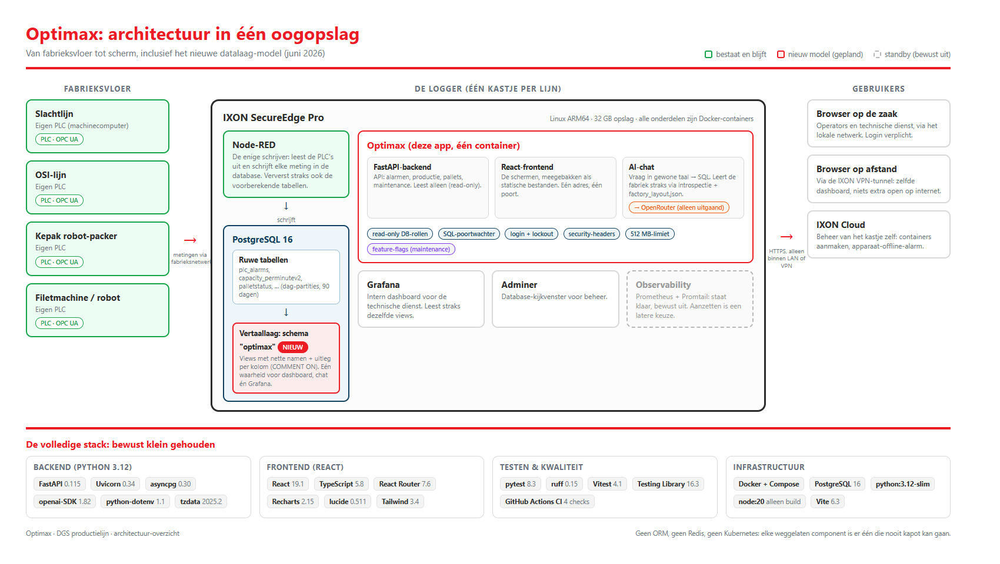

# Optimax: architectuur-hercheck en library-overzicht

Is de huidige opzet nog steeds de verstandigste keuze nu het nieuwe datalaag-model (views, slimme chat, Grafana op dezelfde bron) op tafel ligt? Plus: alle gebruikte libraries op een rij, in gewone taal. Juni 2026.

## Waarom deze check

Het onderzoek naar de datalaag (zie `optimax-datalaag-en-chat-onderzoek.md`) introduceerde een nieuw model: een **vertaallaag van views in de database**, een **chat die de fabriekskennis uit de database zelf leert**, en **Grafana en het dashboard die uit dezelfde bron lezen**. Dat is een flinke verandering in hoe de data stroomt. Een logische vraag is dan: past de rest van de architectuur daar nog bij, of moeten we iets omgooien?

Korte versie van het antwoord: **de architectuur blijft staan**. Het nieuwe model is een verandering ÍN de database, niet om de database heen. Geen enkel onderdeel hoeft vervangen te worden; drie onderdelen krijgen later een kleine aanpassing.

## Het nieuwe model in één alinea (opfrisser)

Nu praat alles (dashboard, chat, straks Grafana) rechtstreeks met de ruwe tabellen die Node-RED volschrijft. In het nieuwe model komt daar een **vertaallaag** tussen: views (virtuele tabellen) in een eigen schema `optimax`, met nette namen en uitleg per kolom (via `COMMENT ON`). Iedereen leest voortaan uit die views. Voordeel: één plek waar "wat betekent counter0" is vastgelegd, en als DGS ooit een ruwe tabel wijzigt, passen we alleen de view aan, niet drie consumenten. De chat wordt slimmer door die uitleg automatisch uit de database te lezen (introspectie) plus een klein bestand met de fabrieksindeling (`factory_layout.json`).

## De check: elke bouwkeuze opnieuw gewogen

| Bouwkeuze | Oordeel | Waarom |
|---|---|---|
| Eén container: FastAPI + React samen | **Blijft** | De views leven in de database, niet in de app. Eén container blijft het beste passen bij het edge-kastje (beperkt geheugen, één poort door de VPN, geen browser-gedoe met twee adressen). |
| Directe SQL met asyncpg (geen ORM) | **Blijft, wordt sterker** | Queries worden juist eenvoudiger zodra ze uit views lezen: de ingewikkelde vertaling zit dan in de view. Een ORM (extra laag die SQL voor je schrijft) zou nu iets toevoegen wat de views al oplossen. |
| PostgreSQL als enige databron, Node-RED als enige schrijver | **Blijft, wordt sterker** | Ook in het nieuwe model schrijft alleen Node-RED. Zelfs het verversen van eventuele voorberekende tabellen (materialized views) doet Node-RED. Optimax blijft volledig read-only, in drie lagen beveiligd. |
| Chat: vraag naar SQL, met poortwachter (sanitizer) en eigen read-only databaserol | **Blijft, met upgradepad** | De beveiliging blijft exact zoals hij is. Wat verandert: de vaste, ingebakken schema-uitleg in de chatcode wordt vervangen door uitleg die live uit de database komt. Minder onderhoud, en de chat kent automatisch nieuwe views. |
| Grafana als apart, intern dashboard | **Blijft** | Grafana gaat straks uit dezelfde views lezen als Optimax. Eén waarheid: een KPI is overal hetzelfde getal. |
| Maintenance-module achter feature-flags, met één duidelijke datakoppeling (seam) | **Blijft, past perfect** | De seam (`maintenance/data.py`) is precies de plek waar straks een view zoals `optimax.motor_currents` wordt aangesloten in plaats van de nepdata. Dat was het hele idee van de seam. |
| Trunk-based development (alles op main, features achter vlaggen) | **Blijft** | Staat los van het datamodel; werkt goed (maintenance draait er al achter). |
| Secret-vrij image, config via omgevingsvariabelen | **Blijft** | Onveranderd nodig: de registry op de SecureEdge is open op het LAN. |

## Wat er straks WEL verandert (drie kleine aanpassingen)

1. **Dashboard-queries verhuizen naar views.** De queries in `backend/routers/production.py` en `alarms.py` lezen nu ruwe tabellen; zodra de views bestaan, wijzen we ze om. Kleine wijziging, want de query-logica verhuist grotendeels de view ín.
2. **Databaserechten uitbreiden.** De twee read-only rollen (app en chat) krijgen leesrecht op het nieuwe schema `optimax`. Eén GRANT-statement per rol.
3. **Chat-schema-uitleg wordt dynamisch.** De hardcoded `SCHEMA_CONTEXT` in `backend/routers/chat.py` wordt vervangen door introspectie (uitleg uit `COMMENT ON` lezen) plus de `factory_layout.json`-tool. De sanitizer en limieten blijven onveranderd staan.

Alle drie wachten op hetzelfde: de **kolom-mapping van DGS** (welke ruwe kolom betekent wat). Dat is stap 1 van het stappenplan in het onderzoeksdocument.

## Alternatieven, nogmaals eerlijk gewogen

- **Een apart BI- of semantic-layer-pakket (zoals Cube of dbt)?** Te zwaar voor één edge-kastje met 32 GB opslag en beperkt geheugen. Views in PostgreSQL doen hetzelfde werk met nul extra containers.
- **Een ORM (SQLAlchemy) invoeren?** Lost een probleem op dat de views al oplossen, en kost geheugen en complexiteit. Niet doen.
- **TimescaleDB (database gespecialiseerd in tijdreeksen)?** Blijft de nooduitgang voor als het volume echt een bewezen probleem wordt. Migreren op een draaiende productielogger is risico dat je niet vrijwillig opzoekt.
- **De chat als aparte service?** De chat is een klein stukje code binnen de backend. Een eigen container zou een extra netwerkpad en extra geheugen kosten zonder voordeel.

Conclusie van de weging: **geen van de alternatieven wint**. De huidige opzet (één slanke container, views als vertaallaag, Node-RED als enige schrijver) blijft de meest verstandige route voor dit kastje en deze klant.

## Library-overzicht: wat draait er en waarom

Bewust klein gehouden: **6 libraries in de backend, 5 in de frontend**. Weinig libraries betekent weinig onderhoud, weinig security-updates en weinig verrassingen. Alles hieronder is vastgepind op een exacte versie, zodat een build vandaag en over een half jaar identiek is.

### Backend (Python 3.12, draait in de container)

| Library | Versie | Wat doet het, in gewone taal |
|---|---|---|
| FastAPI | 0.115.12 | Het web-framework: ontvangt de verzoeken van de browser (bijv. "geef de alarmen van vandaag") en stuurt het antwoord terug. |
| Uvicorn | 0.34.2 | De motor die FastAPI draait: het programma dat daadwerkelijk op poort 8080 luistert. |
| asyncpg | 0.30.0 | De telefoonlijn naar PostgreSQL: voert de SQL-queries uit, met een poule van herbruikbare verbindingen. |
| openai (SDK) | 1.82.0 | De bibliotheek waarmee de chat met het taalmodel praat. Wij wijzen hem naar OpenRouter in plaats van OpenAI. |
| python-dotenv | 1.1.0 | Leest tijdens ontwikkeling het `.env`-bestand met instellingen (wachtwoorden, adressen). In productie komen die via omgevingsvariabelen. |
| tzdata | 2025.2 | De tijdzone-database: zorgt dat "vandaag" Amsterdam-tijd is, ook in een kale container of op Windows. |

### Backend: alleen voor ontwikkelen en testen (niet in de container)

| Library | Versie | Wat doet het |
|---|---|---|
| pytest | 8.3.4 | Draait de geautomatiseerde tests (API-tests, security-regressietests, maintenance-tests, unit-tests). |
| ruff | 0.15.16 | De spellingscontrole voor Python-code: vindt fouten en slordigheden voordat ze in productie komen. |

### Frontend (React, wordt bij het bouwen omgezet naar statische bestanden)

| Library | Versie | Wat doet het, in gewone taal |
|---|---|---|
| React + React DOM | 19.1 | Het raamwerk waarmee de schermen zijn gebouwd: knoppen, tabellen, pagina's die zichzelf verversen. |
| React Router | 7.6 | De wegwijzer: zorgt dat /alarmen, /pallets en /maintenance elk hun eigen pagina tonen. |
| Recharts | 2.15 | Tekent de grafieken (productie per uur, alarmtrends, motorstroom-trend). |
| lucide-react | 0.511 | De icoontjes (belletje, grafiekje, moersleutel). |
| TypeScript | 5.8 | JavaScript met typecontrole: de computer controleert vooraf of de code-onderdelen op elkaar passen. |

### Frontend: alleen voor bouwen en testen

| Library | Versie | Wat doet het |
|---|---|---|
| Vite | 6.3 | De bouwmachine: perst alle frontend-code samen tot een paar kleine bestanden die de browser snel laadt. |
| Vitest + Testing Library | 4.1 / 16.3 | Draait de frontend-tests (klikt virtueel door schermen heen en controleert wat er verschijnt). |
| Tailwind CSS | 3.4 | De huisstijl-gereedschapskist: kant-en-klare opmaakblokjes in plaats van losse CSS-bestanden. |
| jsdom | 25.0 | Een nep-browser voor de tests, zodat ze zonder echte browser kunnen draaien. |

### Infrastructuur (geen libraries, maar de dozen eromheen)

| Onderdeel | Versie/vorm | Rol |
|---|---|---|
| Python-basis-image | python:3.12-slim | De kale Python-omgeving waar de backend in draait. |
| Node-basis-image | node:20-alpine | Alleen tijdens het bouwen: zet de frontend om naar statische bestanden. Zit NIET in het eindresultaat. |
| PostgreSQL | 16 (alpine) | De database. Op de SecureEdge draait de bestaande instantie; lokaal een kopie in Docker. |
| Docker + Compose | - | Verpakt alles in containers; healthcheck, geheugen-limiet (512 MB) en automatische herstart zitten erin. |
| GitHub Actions | - | De controlepoort bij elke push: backend-tests met echte database, frontend-build en -tests, Docker-bouwcheck, secret-scan en lint. |
| Observability-stack | Prometheus, Promtail, Grafana (standby) | Staat klaar in `observability/` maar is bewust uit; aanzetten is een latere keuze (zie monitoring-opties-document). |

### Wat er bewust NIET in zit

Geen ORM, geen Redis, geen aparte message-queue, geen Kubernetes, geen Node.js in productie. Elk van die dingen zou op een gewone server verdedigbaar zijn, maar op een edge-kastje met beperkt geheugen is elke weggelaten component er één die nooit kapot kan gaan.

## Visueel overzicht

Onderstaande plaat vat alles samen: links de fabriek, in het midden de logger met alle containers (inclusief de nieuwe vertaallaag in rood), rechts de gebruikers. Onderaan de volledige library-stack.

## Conclusie

De architectuur is opnieuw tegen het licht gehouden met het nieuwe datalaag-model ernaast, en hij houdt stand. Het nieuwe model versterkt juist de bestaande keuzes: directe SQL wordt eenvoudiger dankzij views, de read-only-opzet blijft intact omdat Node-RED ook de views ververst, en de maintenance-seam blijkt precies de juiste voorbereiding te zijn geweest. De enige echte wijzigingen zijn drie kleine, goed afgebakende aanpassingen die wachten op de kolom-mapping van DGS. Geen herbouw, geen nieuwe componenten, geen extra containers.
